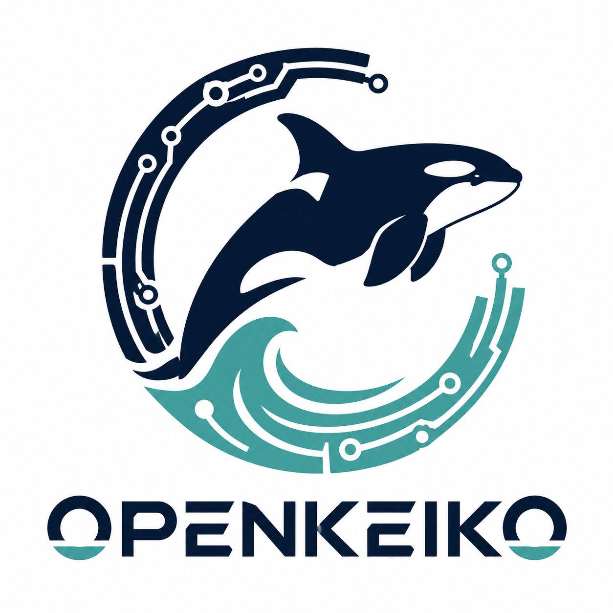

# OpenKeiko Documentation

  

OpenKeiko is an independent effort to document the **FreeWili v1** device and, over time, create open-source software for controlling and working with it.

## What this repository is for

The documentation will grow into a practical, carefully maintained reference covering:

- The device's purpose, capabilities, and terminology
- Hardware details, interfaces, and observed behavior
- Setup, operation, maintenance, and troubleshooting
- Protocols, data formats, and other useful technical references
- Open-source software design, development, and usage
- Project decisions, research notes, and release information

This documentation is intended to provide a verifiable technical reference while distinguishing confirmed information from investigation and interpretation.

## Documentation

- [FW1 hardware overview](docs/hardware-overview.md)
- [FW1 pinout reference](docs/pinout.md)
- [FW1 system architecture](docs/system-architecture.md)
- [Display controller](docs/display-controller.md)
- [Display-side peripherals](docs/display-peripherals.md)
- [Power system](docs/power-system.md)
- [FPGA](docs/fpga.md)
- [Sub-GHz radios](docs/radios.md)
- [External 20-pin header](docs/external-header.md)
- [USB](docs/usb.md)
- [FW1 recovery and flashing](docs/recovery-and-flashing.md)
- [Base MicroPython](docs/micropython-base.md)

## Sources

- [Public source repositories](https://github.com/freewili)
- [Archived product page](https://web.archive.org/web/20250321031454/https://freewili.com/products/freewili/)
- [Component datasheets](docs/component-datasheets.md)
- OpenKeiko evidence: [pinout](docs/pinout.md), [USB](docs/usb.md), [FPGA](docs/fpga.md), [power](docs/power-system.md), [radios](docs/radios.md), and [display peripherals](docs/display-peripherals.md)

## Independence

OpenKeiko is an independent community effort. It is not affiliated with, endorsed by, or sponsored by the original project, its creators, or its maintainers. Product names and trademarks belong to their respective owners.
